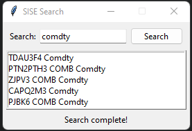

# Security Identifier Search (SIS)
### Financial security identifier data simplifed into a Python search engine.

_This was my submission to my first hackathon, ShellHacks 2022, which I attended virtually!_

## Inspiration

After carefully reading through the various sponsor challenges at ShellHacks 2022, Schonfeld's
"Street ID Challenge" had caught my attention! I knew Python (a language I am more than
comfortable with) was brilliant for data analysis, but I've never actually done realistic
data analysis with Python and its libraries. I've never tried to make a search engine of any
kind, and with very little experience in Pandas or NumPy, attacking Schonfeld's challenge felt
like a great opprotunity to learn more about Python!

## What Is It?

The Security Identifier Search (or SIS)
is a local search engine that returns the most relevant financial securities found in a given
database based off a user search term or query.

## How I Built It

Being developed in Python, I used **pandas** and **numpy** for the database analysis,
**difflib** to calculate relevancy, **time** to calculate search performance, and **tkinter**
for the user interface!

## Challenges I Ran Into

After quick research on pandas and numpy, I immediately knew they would be faster than anything
I could code from scratch. I was able to create a working terminal-based version of the search
engine in an hour or two, but that is where my first problem arose. The first issue I ran into
was time performance: calculating similarity between two strings is slow! My first version of
the search engine took well over two minutes to return any results, and much of the weekend was
actually spent researching and playing with the code to improve its performance.

The second challenge I ran into was how to design this search engine in a way that would be
enjoyable to use. Although it worked well inside of a terminal, no general customer would want
to be fiddling with a terminal! The issue being I've never made a user interface in Python that
wasn't based in the terminal! Thorough research on my options led to tkinter and its
documentation, which led to the current user interface.

## Accomplishments That I'm Proud Of

I am proud of what I've learned throughout the process, including data analysis fundamentals,
string similarity metrics, and user interface deisgn! I went from knowing nothing to being
comfortable in all three topics, and the finished project is something I would happily show to
anyone.

## What's Next?

Despite my accomplishments, I can easily recognize my searching and sorting algorithm is quite
slow, and it is something I plan on continuously researching to improve!
